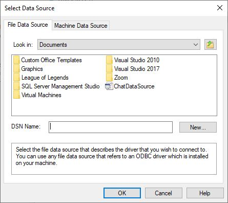
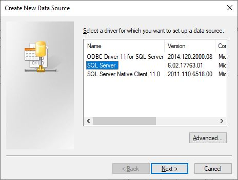
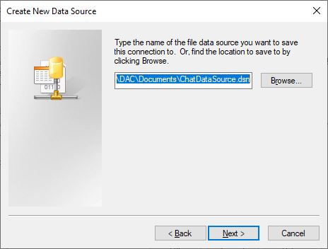
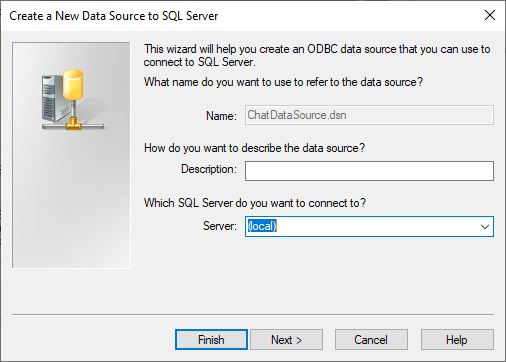
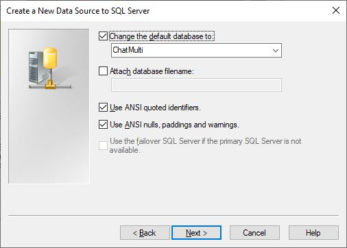
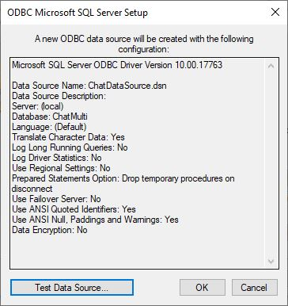
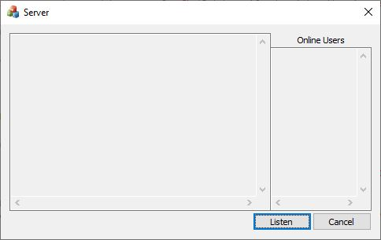
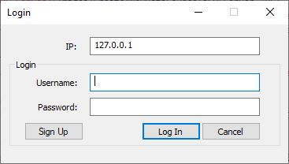
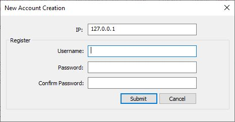
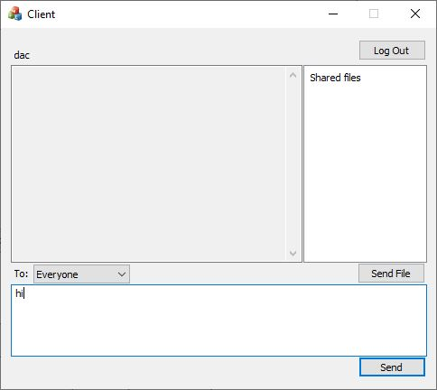

# Client-Server Chat using Socket C++
Client server chat program in C++ using Socket.
## Usage
1. Set up database for server:
    - Run script [ChatDatabase.sql](ChatConference/ChatDatabase.sql) to create database (I'm using SQL Server).
    - After create database, we need to connect it to Server Chat:
      - Run [ServerChat.exe](ChatConference/Release/ServerChat.exe).

        
      - On Select Data Source screen, create new data source for ChatDatabase if not exists otherwise select it and click **OK**, go to **step 2**.
      - Click **New...** button.

        
      - Select your driver, my case is SQL Server then click **Next**.

        
      - Set location to save the data source file then click **Next** and **Finish**.

        
      - Select the appropriate instance of SQL Server to connect to. I chose **(local)** (above image). Click **Next**. The next screen asks for information about the method of authentication that will be used to connect to the data base. Click **Next**.

        
      - Click checkbox **Change the default database to** and select database **ChatMulti** then click **Next** and **Finish**.

        
      - Click the **Test Data Source** button to verify the connection. It should say "TESTS COMPLETED SUCCESSFULLY!". Click **OK** to create Data Source and return to Select Data Source screen.
      - Select Data Source created and click **OK** to connect database with Server Chat.
2. On Server Chat screen, click **Listen** button to start server, server listening on port 25000.

   
3. Run [Client.exe](ChatConference/Release/Client.exe).
    - Login, enter Server IP address to connect with Server Chat (default 127.0.0.1 is localhost).
    
      
    - To create new account, click **Sign Up** button on Login screen.
    
      
    - On Client screen:
    
      
      - Top left corner is the **client's username**.
      - Top right corner is **Log Out** button, click to logout and return to Login screen.
      - Under client's username is **sent message(s)**.
      - Under Log Out button is **shared file(s)**, dboule click on file name to download file.
      - Under sent message(s) is combo box show all **online user(s)**, select one user to chat with or select *Everyone* to chat with all user(s).
      - Under shared file(s) is **Send File** button, click to send file and file name with insert to **shared file(s)**.
      - At the bottom is edit box to type message. Click **Send** button or press **Enter** to send message.
